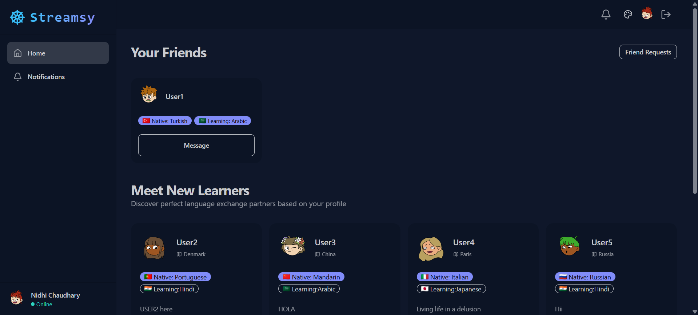
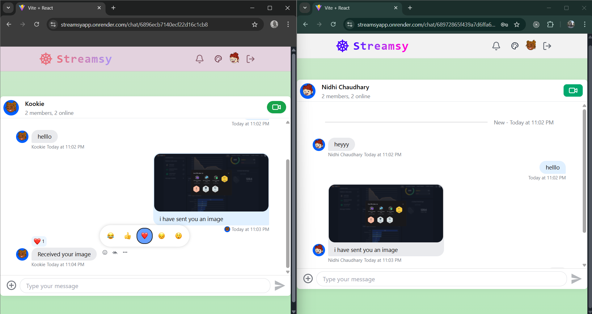
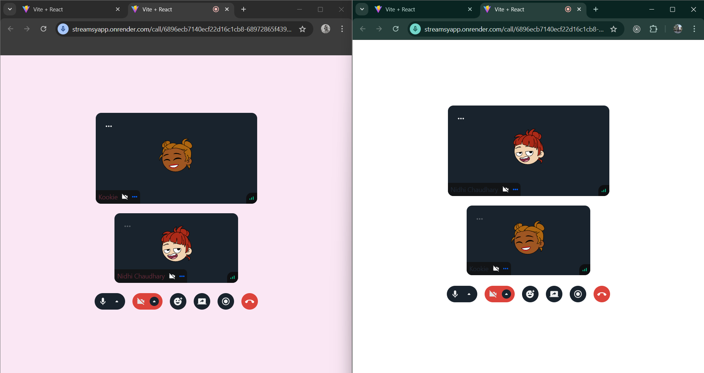
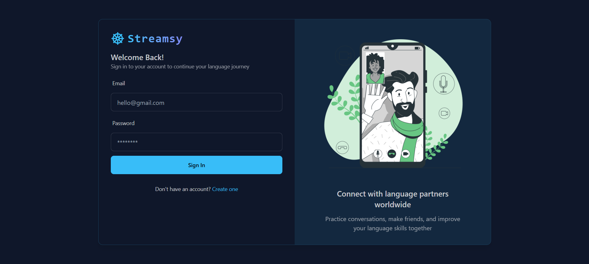
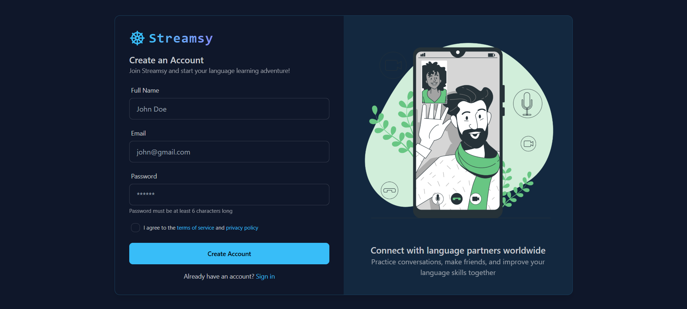
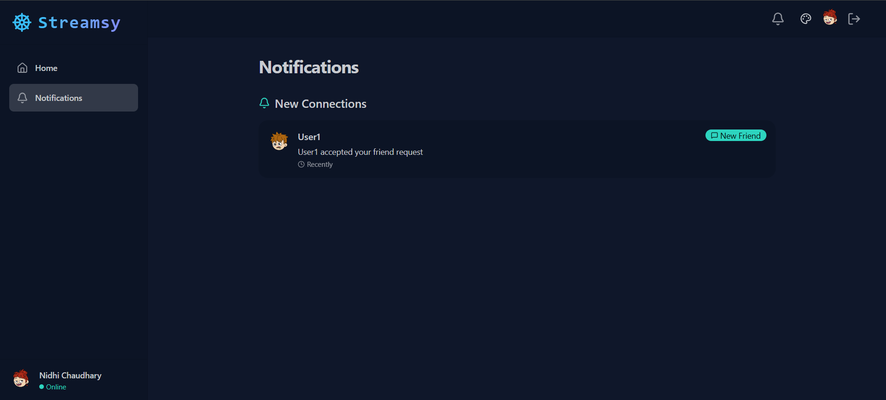

# 🌍 Streamsy – Talk. Learn. Grow. 🌍

Streamsy is a real-time video calling and chat platform that brings people together from around the globe to exchange languages for free.  
Connect with native speakers, practice new languages, and build friendships across cultures — all in one place.

---

## 🚀 Key Features

### 🌐 Multi-Language Chat
- Real-time chat powered by **Stream Chat SDK**
- Smart partner matching based on chosen languages

### 📹 High-Quality Video Calls
- Low-latency global video powered by **Stream Video SDK**
- Screen sharing & virtual backgrounds
- Mute, camera toggle, and participant controls

### 📚 Language Exchange Learning
- Connect with native speakers for free
- Practice pronunciation during live calls
- Learn by chatting in real-world conversations

### 🔐 Secure & Private
- JWT-based authentication with cookies
- Role-based access control *(user/admin)*
- End-to-end encrypted messages

---

## 🖼️ Screenshots

| Homepage | Chat | Video Call |
|----------|------|------------|
|  |  |  |

| Login | Signup | Notifications |
|-------|--------|---------|
|  |  |  |

---

## 🌍 Live Demo
🚀 **Try it now:** [Streamsy Live](https://streamsyapp.onrender.com)

---

## 💻 Tech Stack

### **Frontend**
- ⚛️ React 19 + Vite
- 💅 Tailwind CSS + DaisyUI
- 💬 Stream Chat & Stream Video SDK
- 🧠 Zustand for global state
- 🔄 TanStack Query for server state

### **Backend**
- 🔙 Node.js + Express
- 🛢️ MongoDB + Mongoose
- 🔐 JWT Authentication with Cookies


---

## 🛠️ Getting Started

```bash
#1️ Clone the repository
git clone https://github.com/your-username/Streamsy.git
cd Streamsy

#Setup Frontend
cd frontend
npm install
npm run dev

#Setup Backend
cd frontend
npm install
npm run dev

# Environment Variables
PORT=5000
MONGO_URI=your_mongodb_connection
JWT_SECRET=your_secret
STREAM_API_KEY=your_stream_api_key
STREAM_API_SECRET=your_stream_api_secret
CLIENT_URL=http://localhost:5173

# Frontend .env
VITE_API_URL=http://localhost:5000/api
VITE_STREAM_API_KEY=your_stream_api_key


